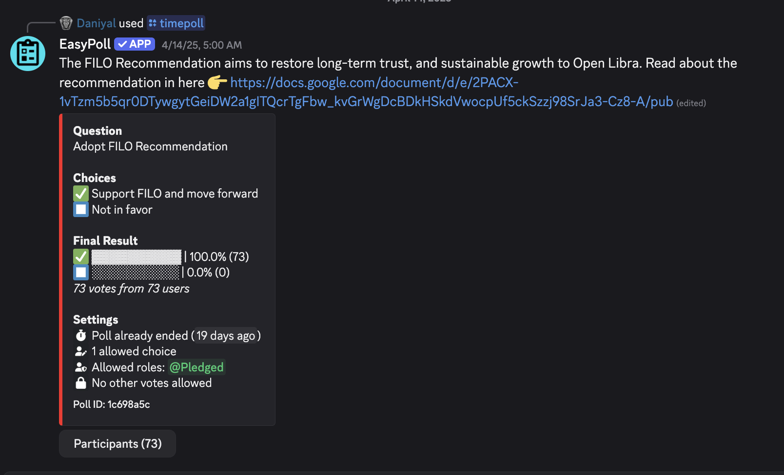

## Overview

UP 10 - Back to FILO

### Status

- DRAFT = Feedback collection

## Script Hash

`0x77ababc11621fe92f8dea07d776a7b0ad8ce90add091e553248289676f47290b`


# Upgrade Instructions

8.0.0 is a Hot Upgrade which only contains upgrades to system smart contracts.

Node software is also updated to 8.0.0, but not strictly necessary for upgrade (version 8 will work on version 7 node binaries).

# Workflow
Hot upgrades should follow this documentation: https://docs.openlibra.io/validators/hot-upgrades

## reproduce the artifacts:
```
libra move framework upgrade --output-dir ./ --framework-local-dir <path-to>/libra-framework/framework --danger-force-upgrade
```

## Motivation

Download [ OL-FILO-Recommendation.pdf](OL-FILO-Recommendation.pdf ) for the context of the proposal.

This upgrade proposal introduces significant policy-related changes centered around the First In, Last Out (FILO) principle — a foundational concept for the OL network. These changes were developed through extensive governance discussions from January to May 2025. Ultimately after two rounds of polling, the community voted unanimously in favor of adopting the policies.




The changes primarily affect how previous accounts are now converted to "Founder" accounts upon re-joining the network. Founder accounts are converted to slow wallets, which are reset with an unlocked amount available of zero. These founder accounts must go through a web of trust-based Sybil test before they can resume unlocking. No coins are lost in this process.

Additionally, this proposal implements enhanced controls for Community Wallets, requiring reauthorization from their donors while gaining the ability to utilize small amounts of unlocked coins through the donor voice mechanism.

These changes strengthen the integrity of the network by ensuring proper verification for rejoining accounts and improving the governance of community funds, all while preserving users' balances.


## Proposed Changes

1. Founder Account Migration from V7 v8
  - Requires manual signed transaction from user to create the necessary data structures on chain.

2. Slow Wallet Conversion for Founders
   - Converts all founder accounts to slow wallets with an initial unlocked amount reset to zero, with global unlock tracking

3. Community Wallet Periodic Authorization
   - Requires community wallets to be periodically reauthorized by their original donors

4. Community Wallet Unlocked Advance Loan
   - Allows donor voice to borrow up to 1% of unlocked balance with enhanced validation for payment proposals

5. Vouch Score - Web of Trust Sybil Test
   - Implements arbitrary and default roots of trust with periodic rotation, scoring-based limits, and page rank thresholds

6. VoteLib refactors
   - Refactors to turnout tally polls which impacted community wallet governance (reauthorization, veto, liquidation)


## Related Pull Requests
### Founder Account System
- Reauthorization Process: Former accounts rejoining the network are now classified as "Founder" accounts and must go through a reauthorization process with web of trust verification (#358)
- Slow Wallet Conversion: All founder accounts are converted to slow wallets with an initial unlocked amount reset to zero (#357)

- Slow Wallet tracking: Implemented a global unlock tracking system where slow wallets have their transferred amounts reset (#374)

### Community Wallet Enhancements

- Donor Authorization: Community wallets now require periodic reauthorization from their donors (#353)

- Capability Pattern: Migrated community wallet structures to use capability pattern for better security (#371)

- Can now borrow up to 1% of unlocked balance (#369)
- Added account validation for payment proposals (#395)
- Refactored unlocked advance workflow (#393)
- Migration of donor voice governance data structures (#388)
- Improved loan advance process (#377)

### Vouching, vouch scoring, and web of trust

- Implemented arbitrary and default roots of trust with periodic rotation (#360)
- Patched vouch walk and re-authentication workflows (#372)
- Added scoring-based limits to the vouching system (#379)
- Implemented page rank score thresholds (#378)
- Patched get vouches view function (#385)

### Reauthorization Workflow:

- Refactored reauth tally system (#391)
- Fixed page rank calculation issues (#391)
- Cleaned up activity tracking and checks (#392)
Governance and Voting
- Turnout Tally: Polls now automatically close when the threshold is met (#384)
- Testnet Governance: Reduced turnout threshold specifically for testnets (#389)
- Entry Functions: Exposed minimal set of entry functions for better security (#380)

### Testnet and Development Tools

- Enhanced twin initialization process (#373)
- Simplified twin network creation from epoch archive bundle (#365)
- Default to staging chain_id for twin networks (#367)
- Added tests for epoch boundary after twin startup (#376)

### CLI and Storage Enhancements:

- Storage tools refactoring for restore and download operations (#361)
- Updated GitHub API usage for epoch archive restoration (#394)
- Fixed CLI logger initialization (#387)
- Patched net-reward argument in validator CLI (#363)
- Unified Rust profiles (#356)
- Removed unused transactional tests (#364)
- Added testnet automation tools (#362)
- Testnet CLI helpers (#366)

Impact
These changes preserve users' coin balances while implementing stronger verification mechanisms for rejoining accounts and community wallet management, reinforcing OL's commitment to the FILO principle through technological safeguards.
